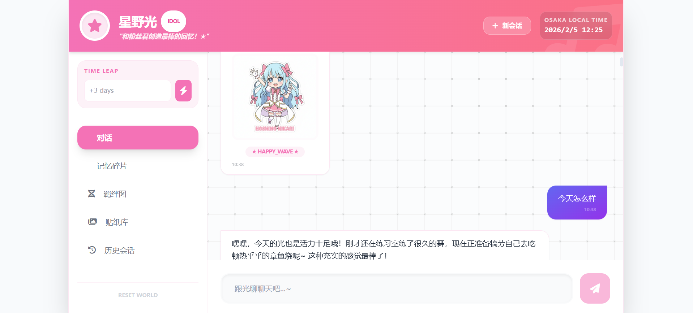
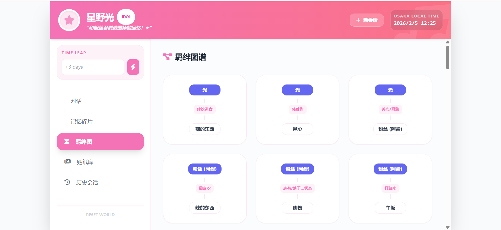
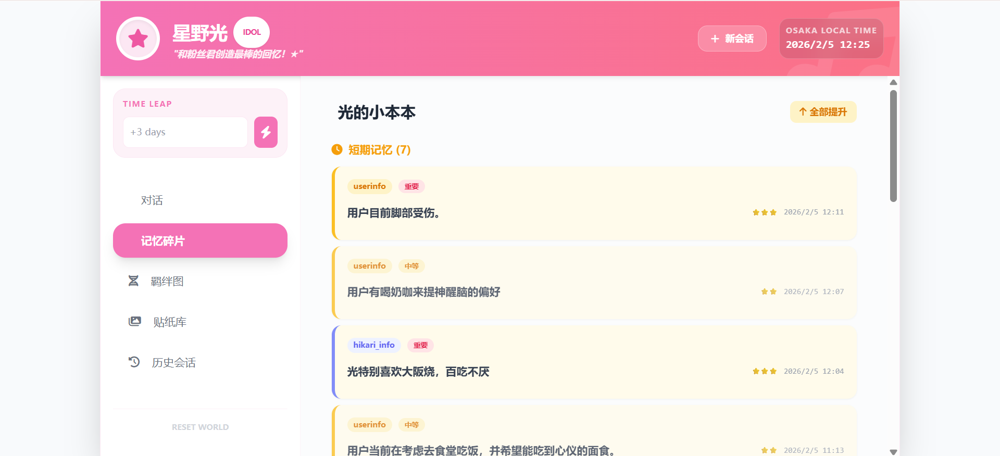
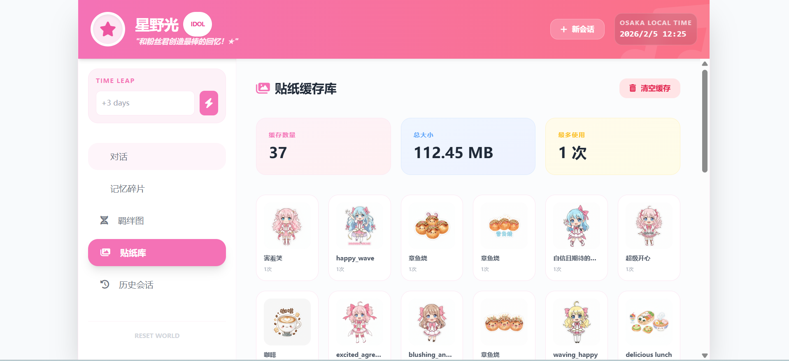

# Hikari - 星野光 🌟

> 一个基于 React + Google Gemini API 的虚拟偶像对话应用，让你的二次元梦想照进现实！


---

## 📸 功能截图

### 对话界面

*主对话界面 - 光会主动关心并延伸话题*

### 记忆系统

*光的小本本 - 短期/长期记忆自动管理，支持编辑*

### 羁绊图谱

*知识图谱 - 每轮对话自动更新实体和关系*

### 贴纸库

*AI 贴纸生成 - 智能缓存，高复用率*

---

## 💬 对话示例

### 场景 1：刚打开应用，光主动关心

**光**：呀吼~粉丝酱！好久不见啦，最近怎么样呀？有没有好好吃饭？光最近一直在想你呢~★

### 场景 2：聊到喜欢的音乐

**粉丝君**：我最近喜欢听摇滚乐

**光**：哇！摇滚超酷的！光也超喜欢摇滚呢~特别是那种吉他solo超燃的时候！粉丝君有没有特别喜欢的乐队呀？光最近在听 ONE OK ROCK，他们的歌真的超棒的！要不要推荐给你？

### 场景 3：分享美食

**粉丝君**：今天吃了章鱼烧

**光**：啊！章鱼烧！光的最爱~大阪的章鱼烧才是最正宗的！下次光带粉丝君去通天阁附近吃好不好？那里有一家超好吃的老店，外酥里嫩，章鱼超大只！说到这个光都饿了~😋

### 场景 4：离线后重新回来

**光**：粉丝酱！你回来啦！光等了好久好久呢...你不在的时候光一直在听歌练习，还发现了一首超棒的新歌！而且...其实光有点想你了...下次不要离开这么久好不好？

---

## 🗂️ 版本存档

- **[v0.2.1](https://github.com/SumanasJ/Virtual-Idol-Hikari)** (当前版本) - 📍 主分支
  - 优化的记忆系统（每轮自动记录）
  - 知识图谱可视化与语义检索
  - 每轮对话基于图谱增强上下文
  - 未来计划：事件生成器（外部世界）

- **[v0.2.0 - Hikari-0205](https://github.com/SumanasJ/virtual-idol-demo/tree/Hikari-0205)** - 早期版本
  - 智能记忆系统（短期/长期自动管理）
  - 羁绊图谱（每轮自动更新）
  - 贴纸智能缓存（高复用率）
  - 多会话管理与离线事件

- **[legacy/old-version](https://github.com/SumanasJ/virtual-idol-demo/tree/legacy/old-version)** - 早期草稿版本（已存档）
  - 第一代原型代码
  - 基础对话功能
  - 仅供历史参考，不再维护

---

## ✨ 特色功能

### 🎭 真实的虚拟偶像体验
- **星野光**：17岁元气大阪虚拟偶像
- 大阪腔说话风格，亲切自然的互动
- 动态性格系统：开朗、温柔、元气、好奇心、同理心
- 实时模拟时间流逝

### 💬 智能对话系统
- 基于 Google Gemini 3.0 Flash 模型
- 自然对话生成，支持多轮上下文
- 主动关心用户，主动找话题
- 自由话题跳跃，不是简单的问答机器人

### 🧠 记忆与羁绊系统
- **短期记忆**：最近对话中的重要信息，每1-3轮自动更新
- **长期记忆**：用户的偏好和重要事实，自动整理和总结
- **去重机制**：智能识别相似记忆，避免重复记录
- **羁绊图谱**：自动提取实体和关系，构建知识图谱
- 用户可编辑记忆，支持纠错

### 🎨 贴纸生成系统
- AI 生成贴纸：情感、美食、地标、表情包
- **智能缓存**：向量相似度搜索，优先复用已有贴纸
- 自动去重，节省 API 调用

### 💾 会话管理
- 多会话支持，可创建、切换、删除会话
- IndexedDB 持久化存储，刷新不丢失
- 跨会话共享记忆和羁绊图
- 会话标题自动生成

### 🌙 离线事件系统
- 离线期间光会主动活动
- 根据离开时间长短生成不同内容
- 重新回来时的特殊问候
- 光会留言、发现新事物、想念你

### 🧠 知识图谱增强
- 交互式图谱可视化（vis-network）
- 语义搜索关系
- 查找共同关联（话题推荐）
- 每轮对话自动基于图谱增强上下文

---

## ⚠️ 重要提示

**本项目目前为演示性质，仅供学习交流使用。请勿将 Gemini API Key 直接暴露在前端并公网部署！**

### 安全建议
- ❌ **不要**将包含 API Key 的代码推送到公开仓库
- ❌ **不要**在生产环境中直接在前端使用 API Key
- ✅ **应该**使用后端代理服务保护 API Key
- ✅ **应该**添加速率限制和滥用保护
- ✅ **应该**使用环境变量管理敏感信息

本项目使用的 API Key 存储在 `.env.local` 文件中（已加入 `.gitignore`），不会被提交到仓库。

---

## 🚀 快速开始

### 环境要求
- Node.js 18+
- pnpm（推荐）或 npm

### 安装

```bash
# 克隆项目
git clone https://github.com/your-username/virtual-idol-demo.git
cd virtual-idol-demo

# 安装依赖（推荐使用 pnpm）
pnpm install
# 或使用 npm
npm install
```

### 配置

创建 `.env` 文件：

```bash
# Google Gemini API Key
# 获取地址：https://makersuite.google.com/app/apikey
VITE_GEMINI_API_KEY=your_api_key_here
```

### 运行

```bash
# 开发模式
pnpm dev
# 或
npm run dev

# 构建生产版本
pnpm build
# 或
npm run build

# 预览生产版本
pnpm preview
# 或
npm run preview
```

访问 http://localhost:3001 开始和光聊天！

## 📁 项目结构

```
Hikari-Gemini/
├── services/              # 核心服务
│   ├── gemini.ts         # Gemini API 对话生成
│   ├── memoryManager.ts  # 记忆管理（IndexedDB）
│   ├── memoryProcessor.ts# 记忆处理和去重
│   ├── topicGenerator.ts # 开场白和总结
│   ├── stickerCache.ts   # 贴纸缓存系统
│   ├── sessionManager.ts # 会话管理
│   └── offlineEvents.ts  # 离线事件生成
├── App.tsx              # 主应用组件
├── types.ts             # TypeScript 类型定义
└── main.tsx             # 应用入口
```

## 🎯 核心技术

### 前端框架
- **React 19.2** - UI 框架
- **TypeScript** - 类型安全
- **Vite** - 构建工具

### AI 能力
- **Google Gemini 3.0 Flash** - 对话生成
- **Google Gemini 2.5 Flash** - 图片生成

### 数据存储
- **IndexedDB** - 浏览器本地数据库
  - HikariMemoryDB - 记忆和关系
  - HikariChatSessions - 会话历史
  - HikariStickerCache - 贴纸缓存

### 算法
- **2-gram 文本向量化** - 文本特征提取
- **余弦相似度** - 贴纸匹配和记忆去重
- **智能去重** - 记录前检查相似性

## 💡 使用技巧

### 对话技巧
1. **分享更多信息**：告诉光你的喜好、习惯，她会记住
2. **自然聊天**：不需要刻意引导，话题可以自由跳跃
3. **查看记忆**：在"光的小本本"中查看她记住了什么
4. **编辑记忆**：如果记错了，点击编辑按钮纠正

### 贴纸系统
- 贴纸会自动缓存，相同的表情会复用
- 支持情感、美食、地标、表情包四种类型
- 在"贴纸库"中查看所有缓存的贴纸

### 羁绊图
- 每轮对话后自动更新
- 展示人、事、物之间的关系
- 随着对话深入会越来越丰富

### 会话管理
- 点击"历史会话"查看所有对话
- 可以创建新会话，保持不同话题独立
- 所有会话共享记忆系统

### 时间跳跃测试 (Time Leap)
- **功能说明**：加速模拟时间流逝，用于测试跨长时间的记忆表现
- **使用方法**：在输入框输入时间调整指令，如 `+3 days`、`+2 hours`、`+1 week`
- **测试场景**：
  - 验证短期记忆是否正确提升为长期记忆
  - 测试离线事件系统（离开很久后回来）
  - 观察记忆整理和去重机制
  - 检查多会话间的记忆共享效果
- **示例**：输入 "+3 days" 后创建新会话，光会根据"离开3天"生成特殊的离线问候

---

## 🗺️ Roadmap / TODO

> **目标**：通过引入变化的"外部世界"（新鲜事件）+ 可控的记忆管理，使光能够长期陪伴。

### 🌟 核心下一步：事件生成器（外部世界）

**为什么需要外部世界？**
- 长期对话需要新鲜话题，否则容易陷入重复
- 外部事件能带来自然的对话机会
- 模拟真实偶像的日常生活和工作

**计划实现的功能：**
- [ ] **事件生成服务**：生成每日/每周事件流（新闻、文化、天气、节日、创作者动态等）
- [ ] **世界状态管理**：维护轻量级事件时间线（时间戳 + 标签），存储在 IndexedDB
- [ ] **上下文构建器**：将世界事件转化为对话上下文
  - 相关性评分（基于用户兴趣/最近对话）
  - 新颖度评分（避免重复）
  - 情感基调选择（与光的人设一致）
- [ ] **主动消息**：光基于世界事件主动发起对话（可选 + 频率控制）

**示例场景：**
```
世界事件："大阪今天举办夏日祭典"
↓
光："粉丝君！今天大阪有夏日祭典呢！要不要一起去？
   光可以穿浴衣，超级可爱的~★而且有章鱼烧、可丽饼...
   哎呀光已经迫不及待了！"
```

### 🔒 安全与部署（生产必需）

- [ ] **API Key 后端化**：使用后端代理服务，添加速率限制和滥用保护
- [ ] **记忆管理 UI**：
  - 查看/编辑/删除记忆
  - 每条消息的"不要记住这个"开关
  - 基于类别的屏蔽（联系人/地址/健康/财务）
- [ ] **更安全的长期记忆写入**：默认保守策略，只存储高置信度的用户偏好和稳定事实

### 🎯 质量改进

- [ ] **基于 Embedding 的检索**：用语义相似度替换 2-gram（保留 2-gram 作为降级方案）
- [ ] **评估日志**：记录记忆命中/未命中 + 事件到上下文的有效性
- [ ] **CI/CD**：添加基础检查（lint/typecheck）和最小测试套件

### ✨ 锦上添花

- [ ] **多人格预设**：偶像模式 / 朋友模式 / 教练模式切换
- [ ] **连续发送功能**：支持用户连续发送多条消息后统一回复（Shift+Enter）
- [ ] **动态回复数量**：根据用户消息数量调整回复段数（用户发 n 条，光回 n~n+2 条）
- [ ] **事件包**：季节性、城市特定、粉丝圈特定
- [ ] **数据导入/导出**：记忆 + 世界时间线的备份恢复

---

## 🔧 自定义配置

### 修改人物设定

编辑 `services/gemini.ts` 中的 `IDOL_PERSONA`：

```typescript
const IDOL_PERSONA = {
    "name": "星野光",
    "age": 17,
    "base_personality": {
        "cheerfulness": 0.8,
        "gentleness": 0.6,
        "energy": 0.9,
        "curiosity": 0.7,
        "empathy": 0.5
    },
    // ...
};
```

### 调整记忆记录频率

编辑 `services/memoryProcessor.ts`：

```typescript
export const shouldRecordMemory = (conversationRounds: number): boolean => {
  // 每2轮记录一次，或50%概率随机记录
  return conversationRounds % 2 === 0 || Math.random() > 0.5;
};
```

## 📝 版本历史

### v0.2.1 - 最新 (2026-02-05)
- ✅ 优化记忆记录标准（每轮对话自动记录，提高覆盖率）
- ✅ 优化记忆记录 prompt（支持多条，放宽标准）
- ✅ 移除记忆纠正弹窗（提升体验）
- ✅ 添加知识图谱增强（语义检索 + 话题推荐）
- ✅ 添加交互式图谱可视化（vis-network）
- ✅ 添加 Roadmap/TODO（重点：事件生成器）

### v0.2.0 - Hikari-0205
- ✅ 优化短期记忆更新频率（每1-3轮）
- ✅ 添加记忆去重机制
- ✅ 羁绊图每轮自动更新
- ✅ 提高贴纸复用率（阈值 0.7）
- ✅ 增强主动关心和找话题能力
- ✅ 移除手动提取功能，完全自动化

### v0.1.0 - 初始版本
- ✅ 基础对话系统
- ✅ 记忆和羁绊系统
- ✅ 贴纸生成
- ✅ 会话管理
- ✅ 离线事件

## 📄 许可证

MIT License

## 🙏 致谢

- [Google Gemini](https://ai.google.dev/) - 强大的 AI 能力
- [Vite](https://vitejs.dev/) - 极速的开发体验
- [React](https://react.dev/) - 优秀的前端框架

## 🌟 Star History

如果这个项目对你有帮助，请给个 Star ⭐️

---

**Made with ❤️ by Hikari Development Team**

*让虚拟偶像走进现实，让每个梦想都有温度* 🌸
